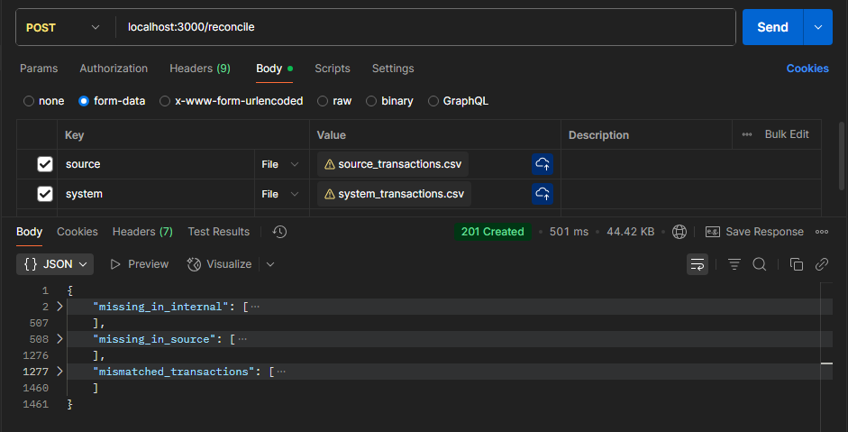

# Transaction Reconciliation

A NestJS-based backend service for reconciling transaction records between two CSV sources (e.g., provider and internal system).

---

## Features

- **CSV File Processing**: Handles large CSV files efficiently with streaming parsing
- **Transaction Reconciliation**: Compares transactions across two data sources
- **Discrepancy Detection**: Identifies missing transactions and data mismatches
- **RESTful API**: Simple HTTP endpoint for file uploads and processing
- **Type Safety**: Full TypeScript implementation with proper type definitions
- **Error Handling**: Comprehensive validation and error reporting

## Prerequisites

- Node.js (v16 or higher)
- npm package manager

## Setup Instructions

### 1. Clone and Install

```bash
# Clone the repository
git clone https://github.com/ibrahimabdalrhman/transaction-reconciliation
cd transaction-reconciliation

# Install dependencies
npm install
```

### 2. Environment Configuration

Create a `.env` file in the root directory or modify the existing one:

```env
PORT=3000
NODE_ENV=development
```

### 3. Running the Application

Choose your preferred mode:

```bash
# Development mode
npm run start

# Development with hot reload
npm run start:dev

# Production mode
npm run start:prod
```

The service will be available at `http://localhost:3000`

### 4. API Usage

#### Reconcile Transactions Endpoint

**POST** `/reconcile`

Upload two CSV files for comparison:

**Request Format**: `multipart/form-data`
- `source`: CSV file from the payment provider
- `system`: CSV file from the internal system

**Example using curl**:
```bash
curl -X POST http://localhost:3000/reconcile \
  -F "source=@provider_transactions.csv" \
  -F "system=@internal_transactions.csv"
```

**Response Format**:
```json
{
  "missing_in_internal": [
    {
      "providerTransactionId": "TXN001",
      "amount": 100.50,
      "status": "completed"
    }
  ],
  "missing_in_source": [
    {
      "transactionId": "TXN002", 
      "amount": 75.25,
      "status": "pending"
    }
  ],
  "mismatched_transactions": [
    {
      "transactionId": "d013dd63-415d-46f3-b06e-491416cd5d59",
      "discrepancies": {
          "amount": {
              "source": 837.3,
              "system": 830.77
          },
          "status": {
              "source": "disputed",
              "system": "refunded"
          }
      }
    }
  ]
}
```

## Postman Example 

#### 

## Technical Design Rationale

### Framework Choice: NestJS
- **Modularity**: Clean separation of concerns with modules, controllers, and services
- **Scalability**: Built-in support for dependency injection and modular architecture
- **TypeScript**: First-class TypeScript support for type safety and developer experience
- **Ecosystem**: Rich ecosystem with decorators, guards, and middleware support

### Key Technical Decisions

#### CSV Processing
- **Library**: `csv-parser` for efficient streaming and memory management
- **Rationale**: Handles large files without loading entire dataset into memory
- **Performance**: Streaming approach allows processing of GB-sized files

#### File Upload Handling
- **Implementation**: `@nestjs/platform-express` with Multer middleware
- **Validation**: Strict CSV file type validation and size limits
- **Security**: File type verification prevents malicious uploads

#### Reconciliation Algorithm
1. **Data Ingestion**: Parse both CSV files into structured objects
2. **Indexing**: Create hash maps using transaction IDs for O(1) lookup performance
3. **Comparison Logic**:
   - Identify transactions present in source but missing in system
   - Identify transactions present in system but missing in source  
   - Compare matching transactions for amount and status discrepancies
4. **Result Compilation**: Structure findings into comprehensive report

#### Configuration Management
- **Library**: `@nestjs/config` for environment variable management
- **Benefits**: Type-safe configuration with validation and default values
- **Flexibility**: Easy configuration for different deployment environments


## Code Review Notes

- *Strengths:*
  - Clean separation of concerns (controller, service, module).
  - Robust file validation and error handling.
  - TypeScript types and async/await for clarity and safety.


---

## License

This project is UNLICENSED. See package.json for details